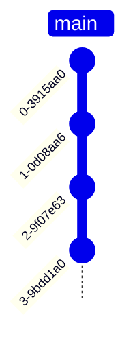
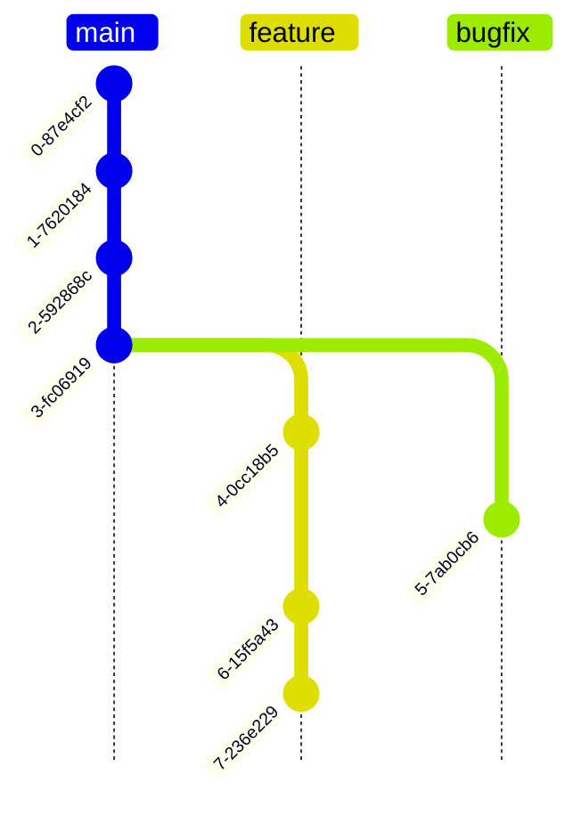
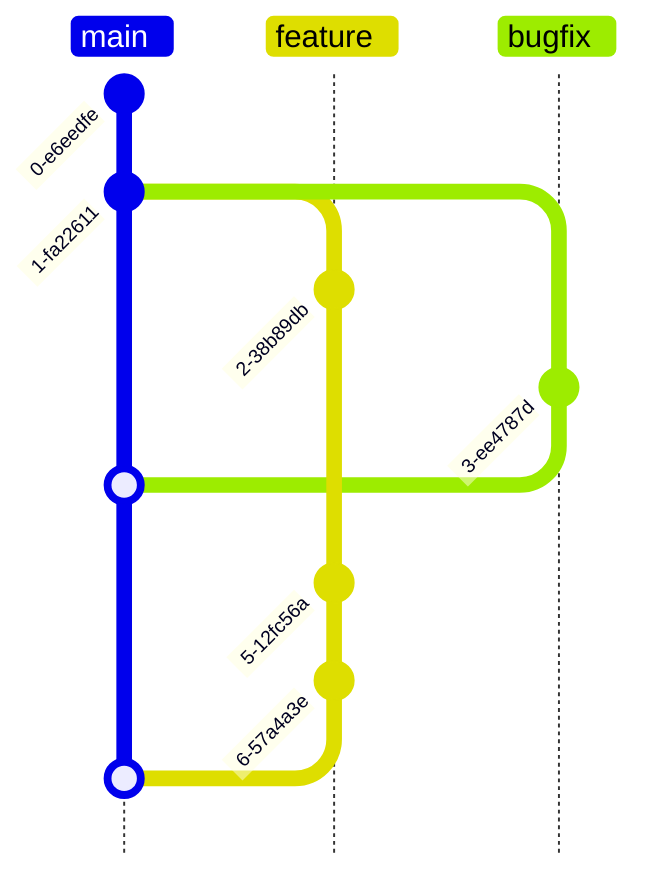

# Learn Git in Practice

_2024.03.13_

程式設計二 TAlk 1 / GDSC NTNU

---

## layout: section

# Recap

---

layout: center
class: bg-white text-black text-center

---

<logos-github-icon class="text-9xl text-white" />

<v-click>

<span v-mark.red="2">Git</span>Hub

</v-click>

---

## layout: two-cols

## Undo, Redo with Commit

<v-click>

版本控制系統 Version Control System (VCS)

以 Commit 為單位的「歷史」記錄

</v-click>

<v-click>



</v-click>

::right::

```sh
git add . # add changes to the staging area
git commit -m "Add feature" # commit changes
```

<br />

<v-click>

Git Patch

```diff
diff --git a/program.c b/program.c
index f26b97c..2f0fad8 100644
--- a/program.c
+++ b/program.c
@@ -1,6 +1,11 @@
 #include <stdio.h>

 int main() {
-    printf("Hello, World!\n");
+    char name[10];
+
+    printf("Enter your name: ");
+    scanf("%s", name);
+
+    printf("Hello, %s!\n", name);
     return 0;
 }
```

</v-click>

---

## layout: center

````md magic-move
```c
// Commit 1 - Hello, World!
#include <stdio.h>

int main() {
    printf("Hello, World!\n");
    return 0;
}
```

```c
// Commit 2 - Support User Name.
#include <stdio.h>

int main() {
    char name[10];

    printf("Enter your name: ");
    scanf("%s", name);

    printf("Hello, %s!\n", name);
    return 0;
}
```

```c
// Commit 3 - Fix Memory Issue.
#include <stdio.h>

int main() {
    char name[1000];

    printf("Enter your name: ");
    scanf("%s", name);

    printf("Hello, %s!\n", name);
    return 0;
}
```

```c
// Commit 4 - Allow Spaces in Name.
#include <stdio.h>

int main() {
    char name[1000];

    printf("Enter your name: ");
    scanf("%[^\n]", name);

    printf("Hello, %s!\n", name);
    return 0;
}
```
````

---

## layout: two-cols

## Doing Experiment with Branch

<v-click>



</v-click>

::right::

```sh
git branch feature # create a new branch
git switch feature # switch to the feature branch
```

<br />

<v-click>

為什麼要開新 branch？

</v-click>

<v-clicks>

-   搞壞東西容易善後
-   不會卡到其他工作

</v-clicks>

<v-click>

以單一任務為開發單位，例如「新增圖片編輯功能」、「修正上傳錯誤」。

而非以人為單位，除非你一次只做一件事。

</v-click>

<v-click>

````md magic-move
```sh
git branch
  howard
  jacob
* main
  ryan
```

```sh
git branch
  feat-photo-edit
  fix-upload-error
* main
```
````

</v-click>

---

layout: two-cols

---

## Use My Code!

<v-click>



</v-click>

::right::

```sh
git switch main # switch to the main branch
git merge feature # merge feature into main
```

<br />

<v-click>

Merge Conflict!

</v-click>

<v-click>

當有兩個 branch 同時修改了同一個檔案的同一個地方，Git 會需要你手動解決衝突。

用 A branch 的修改、B branch 的修改，或者兩者都用。

```c
 <<<<<<<< HEAD
    printf("Hello, World!\n");
 ========
    printf("Hello, Git!\n");
 >>>>>>>> feature
```

</v-click>

---

## Keep Clean

維持 Repository 的乾淨，不要包含不必要的檔案。

<v-click>

例如：

</v-click>

<v-clicks>

-   建構產生的檔案（有原始碼就可以產生了）
-   套件管理器安裝的依賴套件（例如 `node_modules`）
-   包含機密資訊的檔案（例如 `.env` 可能有 API Key）
-   跟專案無關的檔案（例如作業系統索引 `.DS_Store`）

</v-clicks>

<v-click>

善用 `.gitignore` 檔案讓 git 忽略這些檔案。

```sh
*           # ignore all files
!*.*        #   except files with extension
!Makefile   #   except Makefile
.DS_Store   # ignore .DS_Store
```

</v-click>

---

## layout: two-cols

## Collaboration with Remote

<br />

<v-click>

### `git clone`

</v-click>

<v-click>

= `git init` + `git remote add` + `git fetch`

</v-click>

<v-click>

### `git pull`

</v-click>

<v-click>

= `git fetch` + `git merge`

</v-click>

<v-click>

### `git push`

</v-click>

<v-click>

= `git push`

</v-click>

<v-click>

(Ask remote to merge fast-forward)

</v-click>

::right::

```sh
git clone <url> [dir] # clone a remote repository to local
git pull # pull changes from the remote
git push # push changes to the remote
```

<br />

<v-click>

Pull Request

</v-click>

<v-click>

當把 branch 推到 GitHub (remote) 後，可以在 GitHub 上發起 Pull Request 請求合併。

（一種在平台上的 merge 機制）

</v-click>

---

## You Shall Not Pass

善用 GitHub Actions 測試 Pull Request 的是否會破壞原有的功能。

```yaml
name: Test

on:
    pull_request:
        branches:
            - main

jobs:
    test:
        runs-on: ubuntu-latest
        steps:
            - uses: actions/checkout@v4
            - run: make test
```

---

## layout: center

## Let's Write Something Together
